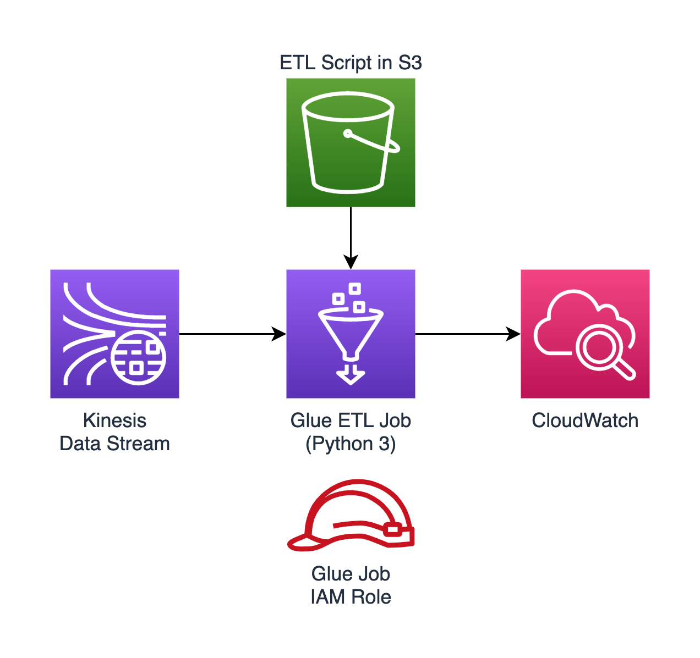

# Terraform AWS Kinesis Stream Glue Job Architecture Pattern

Terraform implementation of a commonly-used AWS architecture pattern of performing streaming ETL on a Kinesis data stream using a Glue job.

The Kinesis data stream:

- Expects its name to be provided as a Terraform variable.
- Has 1 shard.
- Has server-side encryption enabled with AWS-managed CMK.
- Retains its data for 1 day.
- Also creates 3 IAM policies:
  - A policy named `kinesis-stream-YOUR-STREAM-NAME-admin` that allows all operations on this stream: `kinesis:*`.
  - A policy named `kinesis-stream-YOUR-STREAM-NAME-read-only` that allows read operations on this stream:
    - `kinesis:DescribeLimits`
    - `kinesis:DescribeStream`
    - `kinesis:GetRecords`
    - `kinesis:GetShardIterator`
    - `kinesis:SubscribeToShard`
    - `kinesis:ListShards`
  - A policy named `kinesis-stream-YOUR-STREAM-NAME-write-only` that allows write operations on this stream:
    - `kinesis:DescribeStream`
    - `kinesis:PutRecord`
    - `kinesis:PutRecords`
- Has all 7 enhanced (shard-level) metrics enabled:
  - `IncomingBytes`
  - `OutgoingBytes`
  - `IncomingRecords`
  - `OutgoingRecords`
  - `IteratorAgeMilliseconds`
  - `ReadProvisionedThroughputExceeded`
  - `WriteProvisionedThroughputExceeded`

The Glue job:

- Takes its Python 3 ETL script from an S3 location that you provide as a Terraform variable.
- Only has permissions to read from the Kinesis data stream (and the S3 bucket).
- Continuously logs to a CloudWatch log group that retains logs for 14 days.
- Has all CloudWatch metrics enabled.
- Has a job timeout of 1 hour max.
- Will only run 1 instance of this job at a time.
- Uses Glue v2.0 with 2 G.1X workers.
